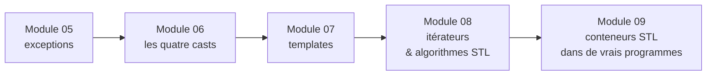

# Modules C++ 05 – 09

 

C++98 avancé, compilé avec `-Wall -Wextra -Werror -std=c++98`. Chaque module couvre un concept à travers de petits exercices thématiques.



## Module 05 — Exceptions

Une simulation de bureaucratie : chaque violation de règle lance une classe d'exception dédiée dérivant de `std::exception`.

| Exercice | Contenu |
|---|---|
| `ex00` Bureaucrat | grade 1–150, `GradeTooHighException` / `GradeTooLowException` en classes imbriquées |
| `ex01` Form | signer exige un grade suffisant ; `beSigned` lance vers le haut, `signForm` attrape et rapporte |
| `ex02` AForm | base abstraite + trois formulaires concrets (`ShrubberyCreation`, `RobotomyRequest`, `PresidentialPardon`), chacun avec son effet de bord dans `execute` |
| `ex03` Intern | `makeForm` instancie les formulaires depuis une string via une table de correspondance (factory) |

## Module 06 — Casts

Un exercice par cast :

| Exercice | Cast | Contenu |
|---|---|---|
| `ex00` ScalarConverter | `static_cast` | détecter le type d'un littéral, convertir en char/int/float/double — gère `nan`, `±inf`, l'overflow, les chars non affichables |
| `ex01` Serializer | `reinterpret_cast` | `Data*` → `uintptr_t` → `Data*`, l'aller-retour rend le pointeur d'origine |
| `ex02` Base/A/B/C | `dynamic_cast` | identification de type à l'exécution par pointeur (test NULL) et par référence (catch), `typeinfo` interdit |

## Module 07 — Templates

| Exercice | Contenu |
|---|---|
| `ex00` whatever | templates de fonctions `swap` / `min` / `max` |
| `ex01` iter | appliquer n'importe quelle fonction à chaque élément de n'importe quel tableau (`template<typename T, typename F>`) |
| `ex02` Array | conteneur templaté : stockage `new[]`, copie profonde, `operator[]` lançant `std::exception` hors bornes |

## Module 08 — Itérateurs & algorithmes STL

| Exercice | Contenu |
|---|---|
| `ex00` easyfind | trouver une valeur dans n'importe quel conteneur d'ints avec `std::find` — l'algorithme ne touche que les itérateurs |
| `ex01` Span | stockage à capacité bornée ; `shortestSpan` / `longestSpan` via copie triée ; `addNumber(first, last)` par plage d'itérateurs tient 10 000+ valeurs |
| `ex02` MutantStack | `std::stack` rendue itérable en héritant et ré-exportant les itérateurs du membre protégé `c` |

## Module 09 — Conteneurs STL dans de vrais programmes

Un conteneur chacun (un conteneur ne peut servir qu'une fois dans le module) :

| Exercice | Conteneur | Contenu |
|---|---|---|
| `ex00` BitcoinExchange | `std::map` | évaluer des lignes `date \| montant` contre un CSV de cours ; `lower_bound` retombe sur la date antérieure la plus proche |
| `ex01` RPN | `std::stack` | calculatrice en notation polonaise inverse (`"3 4 + 2 *"` → `14`) |
| `ex02` PmergeMe | `std::vector` + `std::deque` | tri par insertion-fusion de Ford–Johnson (ordre d'insertion de Jacobsthal), implémenté sur les deux conteneurs et chronométré |

```bash
./PmergeMe `shuf -i 1-100000 -n 3000 | tr "\n" " "`
Time to process a range of 3000 elements with std::vector : 0.83 ms
Time to process a range of 3000 elements with std::deque  : 1.02 ms
```

## Compilation & lancement

Chaque exercice a son propre Makefile :

```bash
cd cpp09/ex01 && make && ./RPN "8 9 * 9 - 9 - 9 - 4 - 1 +"
```
