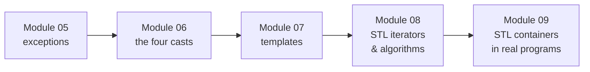

# C++ Modules 05 – 09

 

Advanced C++98, compiled with `-Wall -Wextra -Werror -std=c++98`. Each module covers one concept through small themed exercises.



## Module 05 — Exceptions

A bureaucracy simulation: every rule violation throws a dedicated exception class deriving from `std::exception`.

| Exercise | Content |
|---|---|
| `ex00` Bureaucrat | grade 1–150, `GradeTooHighException` / `GradeTooLowException` as nested classes |
| `ex01` Form | signing requires a sufficient grade; `beSigned` throws upward, `signForm` catches and reports |
| `ex02` AForm | abstract base + three concrete forms (`ShrubberyCreation`, `RobotomyRequest`, `PresidentialPardon`), each with its own `execute` side effect |
| `ex03` Intern | `makeForm` instantiates forms from a string via a lookup table (factory) |

## Module 06 — Casts

One exercise per cast:

| Exercise | Cast | Content |
|---|---|---|
| `ex00` ScalarConverter | `static_cast` | detect a literal's type, convert to char/int/float/double — handles `nan`, `±inf`, overflow, non-displayable chars |
| `ex01` Serializer | `reinterpret_cast` | `Data*` → `uintptr_t` → `Data*`, round-trip returns the original pointer |
| `ex02` Base/A/B/C | `dynamic_cast` | runtime type identification via pointer (NULL test) and reference (catch), `typeinfo` forbidden |

## Module 07 — Templates

| Exercise | Content |
|---|---|
| `ex00` whatever | function templates `swap` / `min` / `max` |
| `ex01` iter | apply any function to every element of any array (`template<typename T, typename F>`) |
| `ex02` Array | templated container: `new[]` storage, deep copy, `operator[]` throwing `std::exception` out of bounds |

## Module 08 — STL iterators & algorithms

| Exercise | Content |
|---|---|
| `ex00` easyfind | find a value in any int container with `std::find` — the algorithm only touches iterators |
| `ex01` Span | capacity-bounded store; `shortestSpan` / `longestSpan` via sorted copy; iterator-range `addNumber(first, last)` handles 10 000+ values |
| `ex02` MutantStack | `std::stack` made iterable by inheriting and re-exporting the protected member `c`'s iterators |

## Module 09 — STL containers in real programs

One container each (a container may only be used once across the module):

| Exercise | Container | Content |
|---|---|---|
| `ex00` BitcoinExchange | `std::map` | evaluate `date \| amount` lines against a CSV of rates; `lower_bound` falls back to the closest earlier date |
| `ex01` RPN | `std::stack` | Reverse Polish Notation calculator (`"3 4 + 2 *"` → `14`) |
| `ex02` PmergeMe | `std::vector` + `std::deque` | Ford–Johnson merge-insertion sort (Jacobsthal insertion order), implemented on both containers and timed |

```bash
./PmergeMe `shuf -i 1-100000 -n 3000 | tr "\n" " "`
Time to process a range of 3000 elements with std::vector : 0.83 ms
Time to process a range of 3000 elements with std::deque  : 1.02 ms
```

## Build & run

Each exercise has its own Makefile:

```bash
cd cpp09/ex01 && make && ./RPN "8 9 * 9 - 9 - 9 - 4 - 1 +"
```
